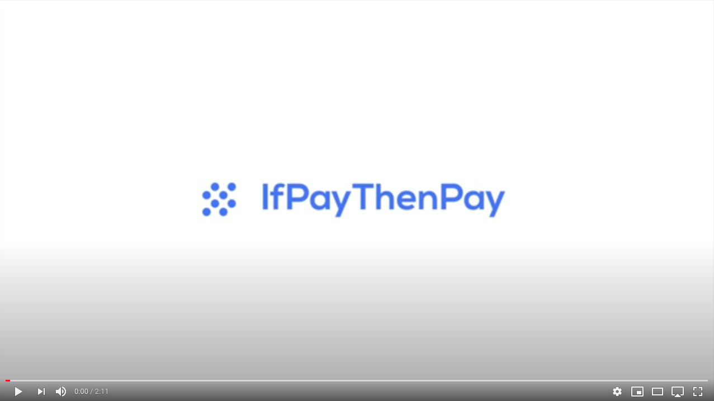

# IF pay THEN pay #HackPrague2020 - We won the 2nd place in HackPrague2020! 🎉

**IF pay THEN pay (IPTP)** focuses on the way people can manage their finances and aims to break the current not so intuitive financial aspect of managing payments that banks offer these days.

With our app you can simply create rules based on incoming and outgoing transactions. Every transaction can now trigger automatic actions you define.

Based on the conditions that you set, the transactions in your bank accounts (i.e. incoming or outcoming payments, amounts spent/received or category) a list of actions, defined logically by you, is then triggered and processed. The system can essentially send out payments without you having to do anything. We aim to make a better option compared to standard standing orders.

Technology-wise, we used NodeJS and NestJS for our back-end services with PostgreSQL as a database. For the front-end we used ReactJS with TailwindCSS for styling. Thanks to BankID, that we used as potential SSO, users have all their banking information available via just one login. Unfortunately, at the moment BankID does not support accessing bank accounts (which will be possible when BankID goes into full production) so we had to integrate our app with ČSAS's PSD2 API directly which allows us to get account details, current account balance, transaction history, and gives us the option to create a new transaction.

## Hackaton introduction

[](https://youtu.be/CZSTSjVVcgc)

## Under the hood (CZ)

[](https://youtu.be/ZnrM3tn_2RU)

## Run the application

```bash
# Backend
$ cd be
$ touch .env.development
$ cat .env.example > .env.development
$ yarn install && yarn start:dev

# Frontend
$ cd fe
$ yarn install && yarn dev
```

## Contact

Contact us! [dev@dxheroes.io](mailto:dev@dxheroes.io)